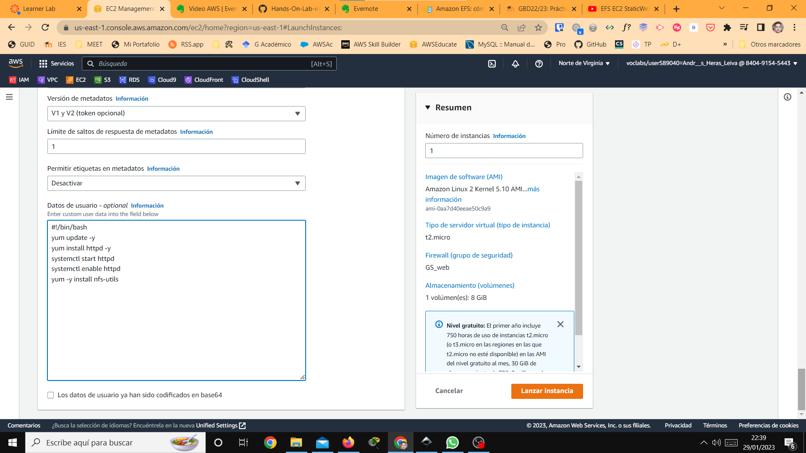

# Despliegue arquitectura EFS-EC2-MULTI AZ conectada una Amazon RDS Multi AZ

## 1. Introduccion
En este documento técnico, se describe como desplegar una arquitectura en la nube de un clúster de servidores web _dinámico_ montados con los servicios de Amazon EC2 en diferentes zonas de de disponibilidad (Multi AZ) que ofrecen archivos almacenados en un sistema de archivos Amazon EFS. Además, estos servidores estarán conectados a una Amazon RDS Multi AZ con una instancia en espera.

Esta arquictetura en la nube la podemos dividir en 3 niveles.

- **Nivel 01**: Es una máquina EC2 que funciona como **balanceador de carga de proxy inverso**, de manera que, las peticiones entrantes puedan ser repartidas y manteniendo el anonimato de los servidores web de nivel 2, mejorando de esta manera, el rendimiento, la seguridad y la fiabilidad.
<br>

- **Nivel 02**: Esta formado por un clúster de servidores web montados con instancias EC2 de **Amazon Linux 2** en dos Zonas de disponibilidad distintas (Multi AZ) donde el servicio web Apache se conecta con un volumen de Amazon EFS que contiene los archivos web. En la web hay un formulario que guardará los datos en el nivel 3 de esta arquitectura.
<br>

- **Nivel 03**: Es una impletación de una Amazon RDS Multi AZ, es decir, una instancia de base de datos principal que replica de manera síncrona los datos en una instancia de una zona de disponibilidad (AZ) diferente. Si la base de datos principal sufriera algún error, Amazon RDS la sustituiría automáticamente por la instancia en espera sin necesidad de intervención manual.

Este tipo de arquitectura de se denomina **AAAA** porque nos da:
**Alta disponibilidad**, ya que tenemos trabajamos en varias Zonas de disponibilidad (Multi AZ); **Alta escalabilidad**, pues tenemos la posibilidad de añadir nuevos nodos o nuevo hardware; **Alto rendimiento**, porque usamos un balanceador de carga nos permite el reparto de solicitudes web; y **Alta Seguridad**, que nos brinda Amazon con las distintas reglas de seguridad, los clúster y el proxy inverso del nivel 1.


## 2. PRACTICA:

<hr>

### 2.1 DESPLIEGUE DE UN CLÚSTER WEB DINÁMICO MULI AZ (NIVEL 2)

<hr>

#### PASO 1. - Creación del grupo de seguridad de las máquinas EC2: SG_WEB

Vamos a Grupos de seguridad y _creamos el grupo_ **SG_web** cuyas reglas de entrada darán permiso para el uso del **puerto  TCP 80 (HTTP) y TCP 22 (SSH)**, **para todo el mundo** para poder configurar las EC2. 


A continuación, crearemos el segundo grupo de seguridad, SG_efs que nos permitirá el tráfico entre los servidores webs y el volumen de archivos Amazon EFS por el puerto TCP 2049. 


#### PASO 2. - Configuración de los servidores web en Multi AZ

Ahora lanzamos 2 ó 3  instancias EC2 de tipo **Amazon Linux** con _par de claves_ tipo **vockey**, pero, en _distintas zonas de disponibilidad_ (**A**vailability  **Z**one) para que el clúster de servidores sea MULTI **AZ**.


 Además, antes de lanzarlas, en la sección de datos de usuario, hay que escribir el siguiente script.

````
#!/bin/bash
yum update -y
yum install httpd -y
systemctl start httpd
systemctl enable httpd
yum -y install nfs-utils
````



<br>

#### PASO 3. - Creación del almacenamiento web: sistema de archivos AMAZON EFS

Para crear el sistema de archivos Amazon EFS, que denominaremos _miefs_, usaremos la VPC por defecto, y la storage class standard.


Creado el sistema EFS, cambiaremos los grupos que vendrán asignados por defecto por el grupo SG_efs creado en el paso 1.

#### PASO 4. - Configuración del servidor: Montaje MANUAL de Amazon EFS a un servidor web

Ahora nos conectaremos a los servidores web y comprobaremos que el servicio httpd está funcionando correctamente, ejecutando el comando
```
systemctl status httpd
```
Si funciona correctmente,  cambiaremos el al directorio /var/www/html y crearemos el directorio _efs-mount_.

```
mkdir efs-mount
``` 
En esta carpeta montaremos el sistema EFS creado el paso anterior, a través de siguiente _montaje manual_:

```bash
sudo mount -t nfs -o nfsvers=4.1,rsize=1048576,wsize=1048576,hard,timeo=600,retrans=2,noresvport Nombre.de.DNS:/ efs-mount  

#El "Nombre de DNS" se copia de la pestaña general de nuestro Amazon EFS creado.
```
Montado Amazon EFS en la carpeta efs-mount, cambiamos al directorio de montaje.

```bash
cd efs-mount
```

y  nos descargaremos los [ficheros](./download/Netflix.zip) de nuestra página web de Netflix y los descomprimos.

```bash
sudo wget https://s3.eu-west-1.amazonaws.com/www.profesantos.cloud/Netflix.zip

sudo unzip Netflix.zip

```

Ahora, todos los servidores web que se conecten al volumen EFS mostrarán la misma web porque todos tienen los mismos archivos. 


#### PASO 5.- Edición de /etc/fstab en los servidores web: Montaje AUTOMÁTICO del sistema de archivo EFS 

En el paso anterior, el montaje que hicimos de la carpeta efs-mount es manual, y por tanto, no permanente, puesto que con el reinicio de la maquina desaparecerá y no tendremos acceso a los archivos descargados.
Ahora vamos configurar la maquinas para que hagan un montaje automático del sistema de archivos EFS para que siempre tengan accesible los archivos.
Antes de nada, hay que editar el document root de httpd para que muestre por defecto la carpeta montada.
```
sudo nano /etc/httpd/efs-mount
``` 
Buscamos la línea  `DocumentRoot "/var/www/html`y la modificamos a  `DocumentRoot "/var/www/html/efs-mount/`

Tras esto nos iremos al archivo "/etc/fstab" y añadimos la siguiente línea para que no se nos desmonte el directorio al reiniciar las máquinas:  

```bash
  tuEFS.EFS.us-east-1.amazonaws.com:/  /var/www/html/efs-mount nfs defaults 0 0
```
<hr>

## CREACIÓN DEL BALANCEADOR DE CARGA Y PROXY INVERSO
<hr>

### PASO 6. - Creamos una EC2 Ubuntu con puerto 80 abierto: Acceso a Internet.

Crearemos una máquina EC2 Ubuntu, que funcionará como balanceador de carga y proxy inverso. Esta no tendrá ninguna configuración adicional en la creación, simplemente deberemos abrir el puerto 80 desde cualquier lugar y el puerto 22 temporalmente hasta que terminemos la configuración.

### PASO 7. - Instalación de Apache2 y configuración como Balanceador de carga y proxy inverso.

#### Instalacicón de Apache2


````
    sudo apt update
    sudo apt install apache2
````
#### Activamos los siguientes modulos de Apache 2

````
    sudo a2enmod proxy
    sudo a2enmod proxy_http
    sudo a2enmod proxy_ajp
    sudo a2enmod rewrite
    sudo a2enmod deflate
    sudo a2enmod headers
    sudo a2enmod proxy_balancer
    sudo a2enmod proxy_connect
    sudo a2enmod proxy_html
    sudo a2enmod lbmethod_byrequests 
````
También podemos escribir este comando de esta manera:
````
sudo a2enmod proxy proxy_http proxy_ajp rewrite deflate headers proxy_balancer proxy_connect proxy_html lbmethod_byrequests
````
Y finalmente reiniciamos el servicio 
````
sudo systemctl restart apache2
````

#### Configuración de Apache: Balanceador y proxy inverso
Ahora, modificaremos el archivo **`/etc/apache2/sites-enabled/000-default.conf`**
````
sudo nano /etc/apache2/sites-enabled/000-default.conf
````

y antes de la línea "&lt;/VirtualHost&gt;" añadiremos lo siguiente:
````bash
ProxyPass /balancer-manager !
    <Proxy balancer://clusterasir>
        # Server 1
                BalancerMember http://ipserverweb1

        # Server 2
                BalancerMember http://ipserverweb2

        # Server 3
                BalancerMember http://ipserverweb3

         </Proxy>

    ProxyPass / balancer://clusterasir/
    ProxyPassReverse / balancer://clusterasir/

    <Location /balancer-manager>
       SetHandler balancer-manager
       Order Deny,Allow
       Allow from all
    </Location>
````
Reiniciamos Apache
````
sudo systemctl restart apache2
````

Y nuestro balanceador estaría terminado.
 Para comprobarlo, abrimos la consola del balanceador,  escribiendo en el navegador `ipdelbalanceador/balancer-manager`. 


 Recargamos varias veces la página web y podremos ver cuantas peticiones se han hecho a cada servidor web.


<hr>

## CREACIÓN DE UN CLÚSTER MULTI AZ
<hr>
Ahora añadimos un formulario a la pagina web, donde los datos recogidos serán almacenados en una base de datos de Amazon RDS Multi AZ con una instancia en espera.

### PASO 8. -  Creación de formulario

Para ello editaremos desde cualquier máquina conectada el Amazon EFS el index.html añadiendo en la `<body>` el siguiente código

```bash
cd /var/www/html/efs_mount
sudo nano index.html
```

Y añadimos el enlace a formulario.php, quedando el archivo de la siguiente manera

```html
  <!DOCTYPE html>
    <html lang="en">
      <head>
        <meta charset="UTF-8" />
        <meta name="viewport" content="width=device-width, initial-scale=1.0" />
        <link rel="stylesheet" href="style.css" />
        <title>Movie App</title>
      </head>
      <body>
        <header>
          <form id="form">
            <input type="text" id="search" class="search" placeholder="Search">
          </form>
        </header>
  


------------------------------------------
NUEVA LINEA: ENLACE A FORMULARIO.PHP
------------------------------------------      

    <a href="formulario.php"> Donativos Siria y Turquia </a>
        
--------------------------------------------------------------
<main id="main"></main>
        <script src="script.js"></script>
      </body>
    </html>


```

Ahora creamos el archivo **`formulario.php`** ejecutando el siguiente comando:

`sudo nano formulario.php`

Escribimos el siguiente código en el archivo creado


```html
<html>
<head>
 <meta charset="UTF-8" />
    <meta name="viewport" content="width=device-width, initial-scale=1.0" />
    <link rel="stylesheet" href="style.css" />
</head>
<body>
<header>
      <form id="form">
        <input type="text" id="search" class="search" placeholder="Search">
      </form>
</header>
<main id="main">
<form action="grabar.php" method="post" class="form">

     <label ><h1> DONATIVOS PARA TURQUIA Y SIRIA </h1></label>
    <label for="name">Nombre :</label>
    <input type="text" id="nombre" name="nombre">
    <br>
<label for="donativo">Donativo: </label>
    <input type="donativo" id="donativo" name="donativo">
    <br>
<input type="radio" name="tipomoneda" value="euro" checked > Euros <br>

    <input type="radio" name="tipomoneda" value="dolar"> Dolares <br>
    <br>
<input type="submit" value ="Enviar" name="enviar" />
</form>
</body>
</html>

```
Como vemos en el documento html, los datos del formulario serán grabados en el archivo _grabar.php_ que crearemos ahora. Ejecutamos el siguiente comando:

```bash
sudo nano grabar.php
```
Y copiamos el siguiente código:
```php
<html>
<head>
 <meta charset="UTF-8" />
    <meta name="viewport" content="width=device-width, initial-scale=1.0" />
    <link rel="stylesheet" href="style.css" />
</head>
<body>
  <header>
      <form id="form">
        <input type="text" id="search" class="search" placeholder="Search">
      </form>
    </header>
<main id="main">
<?php
include ('conexion.php');
$nombre=$_REQUEST['nombre'];
$donativo=$_REQUEST['donativo'];
$tipomoneda=$_REQUEST['tipomoneda'];
$data = [
    'nombre' => $nombre,
    'donativo' => $donativo,
    'tipomoneda' => $tipomoneda,
];
$sql = "INSERT INTO donativos VALUES (null,:nombre, :donativo, :tipomoneda)";
$stmt= $conn->prepare($sql);
$stmt->execute($data);
echo "<div class='center'>";
echo "<h2> Has colaborado con ". $donativo. "  " . $tipomoneda."</h2>" ;
echo "<h2> Donacion registrada correctamente. Gracias por su colaboracion </h2>";
echo "<h2><a href='index.html' > Volver a Inicio </a></h2>";
echo "</div>";
echo "<div class='center' style='font-size:25px;color: #FF0000'>";
 $sql = 'SELECT sum(donativo) as total from donativos;';
    foreach ($conn->query($sql) as $row) {
        echo "TOTAL RECAUDADO ".$row['total'] . "\n";
    }
echo "</div>";
?>
</main>
</body>
</html>
```
Finalmente creamos el arhivo conexion.php.

`sudo nano conexion.php`

Y copiamos el siguiente código:
````php
<?php
$servername = "/*PONER AQUI EL ENDPOINT*/";
$username = "admin";
$password = "Root1234$";
$bd="Cluster";/*CUIDADO CON EL NOMBRE DE LA BD*/
// Create connection
$conn = new  mysqli($servername, $username, $password,$bd);
// Check connection
if ($conn->connect_error) {
    die("Conexión falla " . $conn->connect_error);
}
echo "Conexión exitosa";
?>
````

Ahora tendriamos en Amazon EFS los archivos:

```text
Netflix.zip
index.html
style.css
script.js
formulario.php
grabar.php
conexion.php

```

Crea ahora el archivo prueba.php
`sudo nano prueba.php`

Y pegamos el siguiente código

```php
    <?php 

    phpinfo(); 
    
    ?>
```

¿Qué ocurriría si intentará escribir en el navegador `https://IP.PUBLICA.EC2/prueba.php?` Pues que no funcionaria porque no tenemos PHP instalado en los servidores web. Hay que instalar PHP en todas las máquinas EC2 que funcionan como servidores web.
### PASO 9. - Instalando PHP en todos los servidores web

Ahora vamos a instalar PHP en todas las maquinas EC2 que funcionan como servidores.

Seguiremos el tutorial de la siguiente página. En ella explica como instalar PHP7/8 en una EC2 con Amazon Linux, porque por defecto, AWS Amazon Linux 2 instalará PHP 5.4 si se ejecuta: YUM Install PHP.Para instalar una version superior de PHP sigue los siguiente pasos

#### 1º) Instalar EXTRAS de Amazon Linux
Asegúrese de haber instalado extras de Amazon Linux en su sistema.Ejecutar el comando:

`sudo yum install -y amazon-linux-extras`

#### 2º) Selecciona la version de PHP

El comando Amazon-Linux-Extras mostrará todas las versiones PHP disponibles (y otros paquetes) que se pueden instalar desde el repositorio. Ejecuta:

```
sudo yum update
sudo amazon-linux-extras | grep php
```

Verás un resultado como este


Ahora habilitamos php8.0:

```bash
sudo amazon-linux-extras enable php8.0

```
####  3º) Instale PHP 8.0

Ahora puede instalar PHP 8.0

```bash
sudo yum clean metadata
sudo yum install php-cli php-pdo php-fpm php-json php-mysqlnd php-gd
```

#### 4º) Verifique la versión PHP instalada

Para confirmar la versión PHP instalada ejecuta:

`php -v`

No olvidar repetir el proceso en el resto de máquinas.

### PASO 10. - Creación de un clúster Multi AZ de BD con una instancia en espera

Usaremos para la **creación estándar** porque nos permite _definir todas las opciones_ de configuración, incluidas las de disponibilidad, seguridad, copias de seguridad y mantenimiento. Asi pues, vamos al panel de RDS, pulsamos sobre Crear base de datos, y seleccionamos los siguientes valores en la plantilla

CREAR BASE DE DATOS:

* Elegir un método de creación de base de datos: **Creación ESTÁNDAR**
    * OPCIONES DE MOTOR: **MySQL**
    * PLANTILLAS: **Producción**
        * VERSION DEL MOTOR: **MySQL 8.0.28**
  
    * DISPONIBILIDAD Y DURABILIDAD: **Instancia de base de datos Multi-AZ**
  Crea una instancia de base de datos primaria y una instancia de base de datos en espera en una zona de disponibilidad diferente. Proporciona alta disponibilidad y redundancia de datos, pero la instancia de base de datos en espera no admite conexiones para cargas de trabajo de lectura

CONFIGURACIÓN:

* IDENTIFICADOR DE INSTANCIAS DE BASES DE DATOS: **Cluster**

    * CONFIGURACIÓN DE CREDENCIALES
        * Nombre de usuario maestro: **admin**
        * Contraseña maestra: **la de siempre**
* CONFIGURACIÓN DE LA INSTANCIA: Clases con ráfagas (incluye clases t)
* ALMACENAMIENTO
    * Almacenamiento asignado: **100GiB**
    * Umbral de almacenamiento máximo: **200GiB**
* CONECTIVIDAD:
    * Acceso público: **SÍ**
  
> Cuando pulsemos el botón Crear Base de Datos aparecerá un aviso de que no puede monitorizar la BD, pero sí puedes administrarla.
>

### PASO 11. - Crear grupo de seguridad para Amazon RDS Multi AZ

Para este clúster, crearemos  un grupo de seguridad, SG_MySQL, que permitirá la conexión a través d l puerto  3306 para todo el mundo, hasta que acabemos de editar la base de datos. Momento, en que securizaremos el sistema y solo permitamos la conexión entre el cluster de servidores web con el cluster de Amazon RDS.

### PASO 11. - ****

Para editar la base de datos necesitaremos el endpoint de Amazon RDS y un SGBD (HeidiSQL). Esta es la base de datos a editar:

```SQL
CREATE DATABASE Cluster;
USE Cluster;
CREATE TABLE donativos ( 
id INT(5) PRIMARY KEY AUTO_INCREMENT, 
nombre VARCHAR(30), 
donativo DECIMAL(8,2),
tipomoneda CHAR(5) CHECK (tipomoneda IN ('Euro','Dolar')));
```

Tras comprobar que todo funcione correctamente comenzaremos a securizar el despliegue para ello eliminaremos la regla de entrada de SSH de los grupos de seguridad, quitaremos el acceso público de nuestra base de datos, cambiaremos la regla de entrada del puerto 3306 para que solo esté abierto para conexiones que lleguen desde los servidores web y por último cambiaremos el grupo de seguridad de las maquinas web para que solo el balanceador pueda acceder a ellas una vez hecho esto habremos terminado con el despliegue y con todo esto tendremos las siguientes ventajas:
